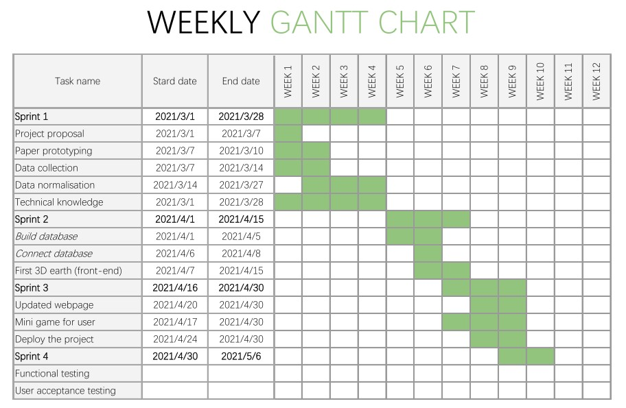

## Sprints & Project Management
### Group working methods:
#### Agile - Kanban
In order to promote our communication, collaboration and flexibility, we considered Agile as our software development approach instead of traditional waterfall approach. There are mainly two frameworks namely Kanban and Scrum for our team to use. We choose Kanban as our primary management tool since it can help us visualize our work, maximizing the efficiency and meanwhile generate continuous flow of work.
#### Communication channels – Jira and Teams
We choose Jira Software as our tool to utilise Kanban, which provide a clear and straightforward Kanban board for us to be aware of the progress of the project and what to do for each member. Therefore, we can balance the workload easily for our team members.  
In addition, we use Microsoft Teams as our communicating tool for weekly meeting. Except for meeting, it is inevitable that we have some issue to discuss. Under the circumstance, we choose Wechat which is convenient for all of us to discuss problems.
### Summary of individual contributions:
**Yunqi Guo:**

**Yao Li:**

**Haojie Xin:**

**Xiaojun Huang:**

**Wang Jiahao:**

### Documentation of sprints and meeting logs:
Although there is no strict sprint for Kanban conceptually, we intentionally separate several sprints for our project in order to maintain a desirable cadence. Moreover, we use a Gantt chart as our roadmap to keep the trace of our project, which is demonstrated below.

#### Sprints:
##### Sprint 0: Preparation for the project

###### Timeline: 9/2/2021 - 25/2/2021  
###### Task finished:
* A serious real-word problem namely protecting endangered animals.

* The idea of a playful mini game to help address the problem.

* Role allocation
* Background information collection

##### Sprint 1:
###### Timeline: 1/3/2021 - 28/3/2021  

###### Task finished:
* Project proposal – finishing the proposal and commit it to our repository.  

* Paper prototyping – the initial design of the layout and interaction of our website
* Data preparation – collecting the endangered animal’s information including distribution, description and treats, and then normalising these data.
* Leaning of related technical knowledge about tools and frameworks we are going to use such as Spring and Docker.

##### Sprint 2: First release of our website  
###### Timeline: 1/4/2021 - 15/4/2021  

###### Task finished:

* First webpage which shows a 3D earth that is draggable, and there are interactable points on the earth.

* Build the database and connect it to backend.

###### User stories accomplished:  

* A user can see a dynamic 3D earth which is draggable on the website.

* There are some luminous points on the earth, and by using cursor to hover in a point, a user can preview the name and appearance of the endangered animal.

##### Sprint3: Show detailed information of animals and mini game

###### Timeline: 16/4/2021 - 30/4/2021  

###### Task finished:

* Be able to deploy the project using Docker

* More detailed information provided in the webpage
* Provide an interactive game for users to play

###### User stories accomplished:
* A user can click the luminous points to access more detailed information about animals including distribution, description, threats and the link to Wikipedia.

* A user can play a mini game to test whether he understand the distribution of endangered animals and also consolidate the memory. The user should choose the right distribution area of a animal. Finally, a score and accuracy rate will be given according to the user’s choice.

##### Sprint4: Evaluation
###### Timeline: 16/4/2021 - 30/4/2021  

###### Task finished:  

#### Meeting logs  
We almost hold a meeting everyweek. To view out meeting minutes, click the link below please.  
[9/2/2021](MeetingLogs/9.2.2021.md)  
[16/2/2021](MeetingLogs/16.2.2021.md)  
[25/2/2021](MeetingLogs/25.2.2021.md)  
[9/3/2021](MeetingLogs/9.3.2021.md)  
[18/3/2021](MeetingLogs/18.3.2021.md)  
[25/3/2021](MeetingLogs/25.3.2021.md)  
[9/4/2021](MeetingLogs/9.4.2021.md)  
[20/4/2021](MeetingLogs/20.4.2021.md)    
[24/4/2021](MeetingLogs/24.4.2021.md)  
[27/4/2021](MeetingLogs/27.4.2021.md)  
[28/4/2021](MeetingLogs/28.4.2021.md)     
[1/5/2021](MeetingLogs/1.5.2021.md)     
[2/5/2021](MeetingLogs/2.5.2021.md)     
[3/5/2021](MeetingLogs/3.5.2021.md)     
[6/5/2021](MeetingLogs/6.5.2021.md)     

