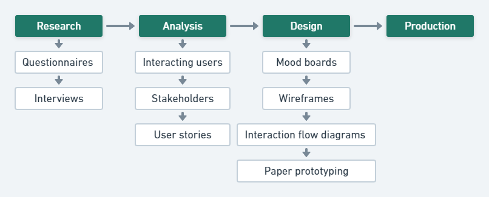

# UX design

For UX design, we followed the UX process provided by [UX mastery](https://uxmastery.com/resources/process), which includes research, analysis, design and production. In this part, we will focus on the first three phases since production phase will be covered in system implementation part. We use several techniques to better accomplish UX process. For example, we use questionnaires and interviews in research phase, and we analyze interacting users and stakeholders. Then, we considered the user stories that we would like to bring about. Finally, in the design phase, we utilized mood boards, wireframes, interaction flow diagram and generate a clickable prototype at last.

## Research

### Questionnaires

 
 
We did a quick survey after confirming our topic namely protecting wild endangered fauna. The survey includes questions about whether users have experienced similar website, what presenting method survey respondents prefer and what kinds of playful game they prefer. At the end, we ask respondents who are willing to participate our future interviews for emails so that we can get in touch with them later. The survey is still open, you can click the icon above to view questions.

  

  

We collect 59 responses in total. As demonstrated in these charts above, most respondents (39 out of 59) have visited similar website, but they would like to have a better experience. More than 2/3 respondents think that 3D earth is the best way to present endangered animals. In addition, the average rate of the respondents’ willingness to have a website which can present endangered animals vividly is around 4, and this means that the demand for our project is substantial. Moreover, more than half of respondents regard the Q&A approach is effective for consolidating the impression for endangered animals. To sum up, the result is within our expectation, and we need to ask some detailed questions for the respondents who complete the last question in which they provide the contact methods.

### Interviews

We talked with two potential users via text chat about the idea of our project and opinions about the design of our website. The finding of two interviews is demonstrated below:

**About the topic:**

**Q1: Are you interested in protecting endangered animals?**  
Interviewee 1 says “Sure, I would like to make contribution to protecting endangered animals if possible.”
Interviewee 2 says “Not very, because I believe protecting individuals of endangered animals makes no sense biologically especially for some uncommon animals for humans.”  
**Q2: Can you recognize the following animals as Endangered or Least Concern animals?**  

  
The correct answer is that the middle one called Haliaeetus leucocephalus is Least Concern animals while the others are Endangered animals called Hippopotamus and Golden hamster.
Both interviewees cannot classify those animals perfectly, and they are also surprised by the result. Interviewee 1 says “Hippopotamus should be common animals in zoo, how come it belongs to endangered animals.”

**Q3: What is your attitude to activities about animal protection?**  
Interviewee 1 believes that those activities are essential, and he says, “endangered animal is vital for the biodiversity, which tends to benefit not only human but also the earth”. However, interviewee 2 hold a different opinion, and he says that it is inevitable that some species will distinct because only the fittest can survive. Human beings should not interfere the natural process.

**About the design of earth page:**

**Q1: For presenting those endangered animals, how do you think the method we use namely a 3D globe containing luminous points that representing animals?**  

Both interviewees like the way we present animals namely using 3D dynamic globe, and they believe that the method is more intuitive than others such as list or pure pictures.

**Q2: Do you have any suggestions about the globe?**  
Interviewee 1 says that when users enter the earth page, the globe should rotate gently, which makes the page more vivid, and it will elicit users to drag the globe.
Interviewee 2 also provides a suggestion that when users click the luminous point, the earth should zoom in to the area while the details should be list at the right.

**About the design of game page:**

**Q1: Do you have any suggestions about the design of game page namely answering questions?**  
Firstly, the layout of those cards, one agrees that a new card should appear after completing last question. However, the other interviewee think that it is more intuitional if the cards are shown in one page and users can click other cards to change questions. Then, we discuss whether the question card should change to next one automatically after users complete the question. Both of them agree that it should not change directly, and they say, “users are likely to have a further look at the question regardless of the correctness of the answer”.

**Q2: Do you think that Q&A is an effective way to consolidate users’ memory about these animals?**  
Interviewee 1 argues that it is to some extend effective, but some users are likely to be not interested in answering questions. Consequently, it is signification to make those question interesting.
Interviewee 2 says “I think Q&A is boring, most users probably will not play the game. If they want the information of endangered animals, they will explore the globe page instead of answering those questions.”

## Analysis

### Interacting users

Combine the result and our thoughts, we considered the following user groups as the interacting users of our website.

- People who spend a lot of time in the wild such as hunters, geologist, archaeologist and so on
- People who are interested in protecting endangered fauna
- People who require a playful way to present endangered fauna such as biology teachers

### Persona

We create two personas based on our research, and we are going to utilize the personas for further analysis and test.

### Stakeholder analysis

There are large numbers of stakeholders involved in this new website about protecting endangered animals. We will lay more emphasis on several primary stakeholders including users, endangered animals, some NGOs and our data suppliers.

We analyze stakeholders in two aspects namely interest and power. To begin with users, they have both strong interest and power related to our project since they can not only access our website to get information but also come up with opinions about the website. In addition, for endangered animals, they have little power but high interest to the website because they tend to benefit from this project. As for NGOs such as World Animal Protection and WildAid, we would not regard them as our competitors, but we do provide a different way to present endangered animals. Consequently, our creativity is likely to influence and benefit each other. Therefore, we believe that NGOs have high power and interest in the project. Finally, we choose Wikipedia as our data source, and since it is an open source, it will not gain from our project, but they have strong power since our data are in the charge of Wikipedia. 

We produced a power/interest matrix to demonstrate these stakeholders more straightforwardly which is shown below. 

### User stories

- A user can see a dynamic 3D earth which is draggable on the website.
- There are some luminous points on the earth, and by using cursor to hover in a point, a user can preview the name and appearance of the endangered animal.
- A user can click the luminous points to access more detailed information about animals including distribution, description, threats and the link to Wikipedia.
- A user can play a mini game to test whether he understand the distribution of endangered animals and also consolidate the memory. The user should choose the right distribution area of a animal. Finally, a score and accuracy rate will be given according to the user’s choice.
- A user can play a mini game to test whether he can distinguish the name among wild animals with similar appearance. Finally, a score and accuracy rate will be given according to the user’s choice.

## Design

### Mood boards

  
While creating our Moodboard, we firstly want to express the mood that we are gray about these animals facing with distinction, and we also include some photos about hunting which is out initial motivation that is preventing endangered animals from hunting no matter intentionally or accidentally. Moreover, we add some pictures that can inspire us about the key elements in our website design such as the earth and some animal cards. For example, we present a globe in our home page and we also use cards containing questions in our game page.

### Wireframes

Wireframe is the first paper prototype we design for the website, the first screen is our home page. It includes navigation bar and the a body which is a wild animal picture. Another page is our game page which includes the question cards and button to switch cards. For the earth page, the first one is the default page when users enter the website, and the second one is the layout of animal details when users click these yellow points.  

### Interaction flow diagrams

While design the wireframes, we consider the interaction flow of our users, and the design outcome is demonstrated below.  

### Paper prototyping

We made 6 screens for the prototype. While completing the final prototype, we improve the design and some interactions. For example, we use different color for the button is navigation bar to help user distinguish the current page and it is intuitional for them to click the other button. Moreover, in the game page, except for clicking the arrow at both side, users can click the question card they prefer to switch current question. In addition, we generated a interactive and clickable model for users to test via InVision, you can access the model by clicking the link below.  

[Clickable prototype](https://xiaojun507579.invisionapp.com/console/share/PQ2J2NHWAU/617500159)

