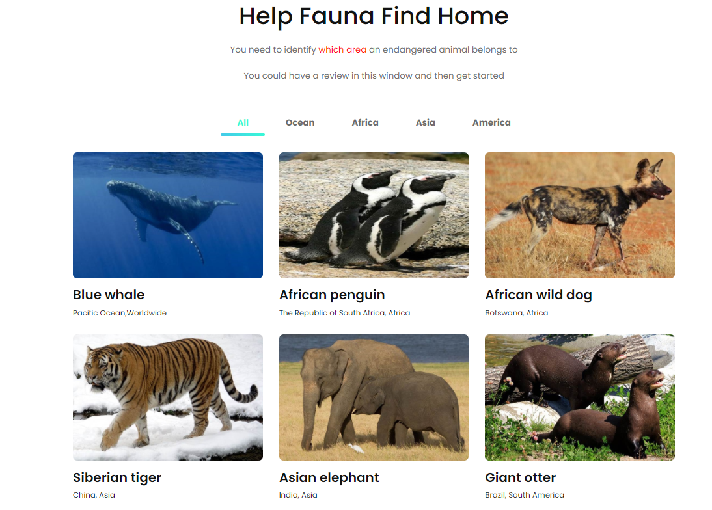
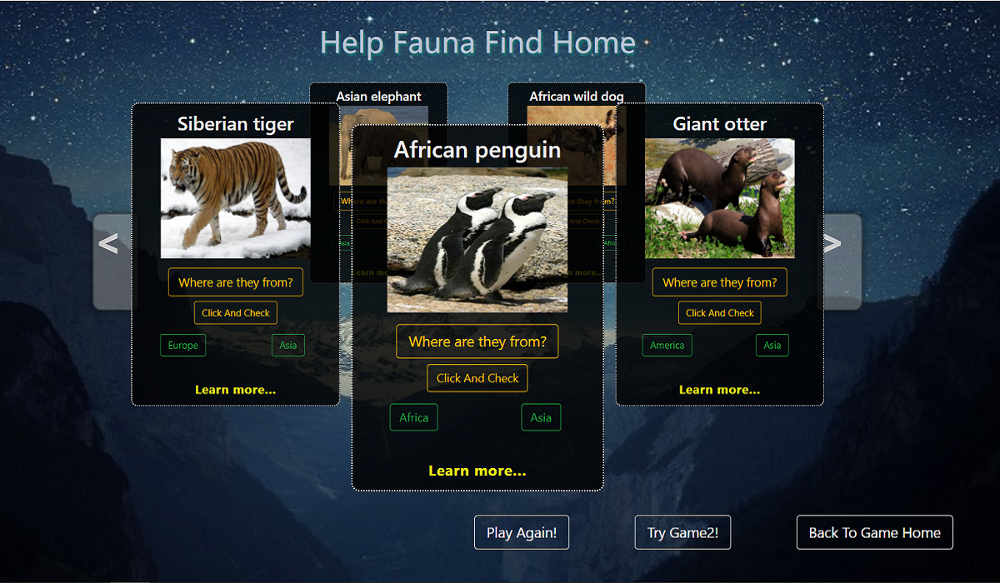

# Endangered Fauna World Window 
1. Dynamic Earth
2. Game Home

## Dynamic Earth?(developing......)
1. Rotate the earth and see the full picture of the earth. By the way, you would find the area that is close to you.
2. Move your mouse to the small spot on different places and you would get the picture and description of one endangered fauna. Try to know about it.

## Game Home? [Go To Game Home Page](http://www.efww.top)
1. Enhance your impression of endangered fauna and learn more about it by palying games.
2. Identify the difference between similar endangered fauna and test your observation ability.

## Before The Game
You could have a review of some endangered fauna in the game home page and start the game. The review would help you make a sensible choice.

 

## Game1-Help Fauna Find Home
- ### Background 
In order to protect endangered animals, scientists have brought them to a safe place to protect them. Now that their populations have expanded, animals can return to their homes. Could you help endangered animals find homes with scientists? 

- ### Instruction
There are one right area where the fauna comes from and one confusing choice. You should try to click and choose the right one.

 

## Game2-Observation And Memory Test
- ### Background 
There are many similar animals among the endangered animals. For ordinary people, it is difficult to distinguish animals that belong to one group. Can you find the difference between them?

- ### Instruction
There are two names in each card. You should guess the right name and click.

 

### [Tip]
- There is a tricky way to make each choice right. 
- If you don't get all passed for the first time, try again. Talk with your friends and explore the tricky way to get full marks.
